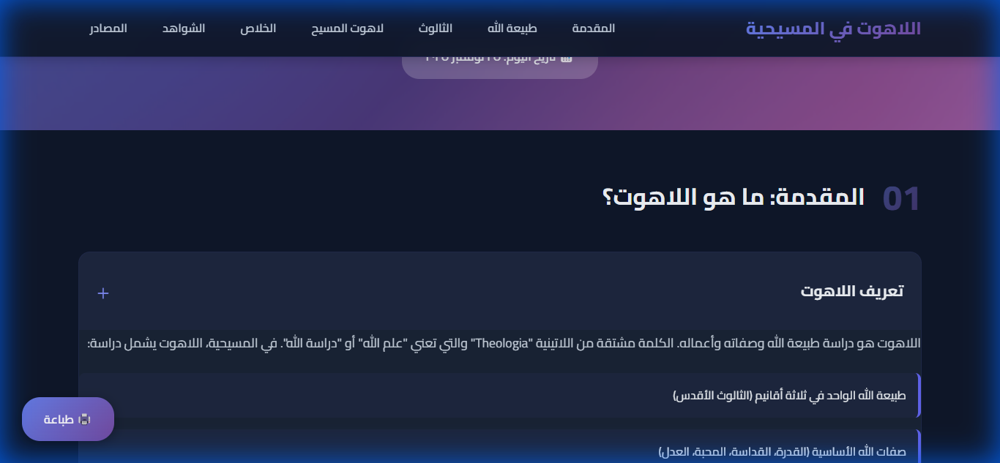

# Theology - Interactive Christian Theology Guide

An interactive web application providing a comprehensive guide to Christian Theology in Arabic. This educational resource covers fundamental theological concepts including the nature of God, the Trinity, Christology, and Salvation, with extensive biblical references and interactive features.

🌐 **Live Website**: [abanoub-magdi.github.io/Theology/](https://abanoub-magdi.github.io/Theology/)

## 📋 Description

**Theology** is an interactive educational web application designed to provide a comprehensive understanding of Christian Theology in Arabic. The project serves as a digital resource for studying fundamental Christian doctrines, featuring:

- **Interactive Content**: Expandable cards and sections for easy navigation
- **Biblical References**: Over 30 biblical references with search functionality
- **Comprehensive Coverage**: Topics including the nature of God, Trinity, Christology, and Salvation
- **Modern UI/UX**: Beautiful, responsive design optimized for Arabic (RTL) reading
- **Print-Friendly**: Optimized for printing and offline study

Perfect for students, teachers, and anyone interested in learning about Christian Theology in Arabic.



## ✨ Features

- 📖 **Comprehensive Theological Content**: Covers essential Christian doctrines
- 🔍 **Interactive Biblical References**: Searchable database of 30+ biblical verses
- 📱 **Responsive Design**: Works seamlessly on desktop, tablet, and mobile devices
- 🎨 **Modern UI**: Beautiful gradient designs and smooth animations
- 🌐 **RTL Support**: Fully optimized for Arabic right-to-left reading
- 🖨️ **Print Functionality**: Built-in print feature for offline study
- ⌨️ **Keyboard Shortcuts**: Quick navigation and search shortcuts
- 📚 **Source References**: Comprehensive list of theological sources and references

## 🛠️ Technologies Used

- **HTML5**: Semantic markup and structure
- **CSS3**: Modern styling with gradients, animations, and responsive design
- **JavaScript (ES6+)**: Interactive functionality, modal system, and search features
- **Google Fonts**: Cairo and Amiri fonts for beautiful Arabic typography

## 📦 Installation

1. Clone this repository:
```bash
git clone https://github.com/Abanoub-Magdi/Theology.git
cd Theology
```

2. Open `index.html` in your web browser:
```bash
# Using a local server (recommended)
python -m http.server 8000
# Then visit http://localhost:8000
```

Or simply open `index.html` directly in your browser.

## 🎯 Usage

### Viewing the Application

1. Open `index.html` in a modern web browser
2. Navigate through sections using the top navigation menu
3. Click on expandable cards to view detailed content
4. Click on biblical reference badges to view full verses
5. Use the search box in the References section to find specific verses

### Keyboard Shortcuts

- `Ctrl + F`: Focus on the search box
- `ESC`: Close any open modals
- `Scroll`: Smooth scrolling navigation

### Print Functionality

Click the print button (🖨️) in the bottom-left corner to print the entire document with all cards expanded.

## 📚 Content Sections

1. **المقدمة (Introduction)**: What is Theology?
2. **طبيعة الله (Nature of God)**: God's essential attributes
3. **الثالوث (Trinity)**: Understanding the Holy Trinity
4. **لاهوت المسيح (Christology)**: The deity and humanity of Christ
5. **الخلاص (Salvation)**: Theology of salvation
6. **الشواهد (Biblical References)**: Searchable database of biblical verses
7. **المصادر (Sources)**: Theological references and resources

## 🎨 Project Structure

```
Theology/
├── index.html          # Main HTML file
├── styles.css          # Stylesheet with RTL support
├── script.js           # JavaScript functionality
└── README.md          # Project documentation
```

## 🌐 Deployment

This project is deployed using GitHub Pages and is accessible at:
**https://abanoub-magdi.github.io/Theology/**

## 📝 License

MIT License

## 👤 Author

**Abanoub Magdi**

- GitHub: [@Abanoub-Magdi](https://github.com/Abanoub-Magdi)
- LinkedIn: [Abanoub Magdi](https://www.linkedin.com/in/abanoub-magdi)
- Portfolio: [abanoub-portfolio-one.vercel.app](https://abanoub-portfolio-one.vercel.app/en)

## 🤝 Contributing

Contributions, issues, and feature requests are welcome! Feel free to check the issues page or submit a pull request.

## 🙏 Acknowledgments

- Biblical references from the Arabic Van Dyck translation
- Theological sources listed in the Sources section
- Google Fonts for Arabic typography support

---

**Note**: This project is an educational resource for studying Christian Theology. It is designed to be respectful, accurate, and helpful for those seeking to understand Christian theological concepts.
